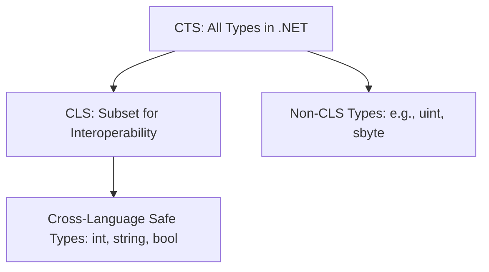

# Common Type System (CTS) and Common Language Specification (CLS)

## 1. Introduction
When multiple languages run on the **.NET Framework**, they need a way to:
- Share data types
- Work together without conflicts
- Ensure type safety and consistency

This is where **CTS (Common Type System)** and **CLS (Common Language Specification)** come in.

---

## 2. What is CTS?
**CTS (Common Type System)** defines all the data types that can be used in the .NET runtime.

- It ensures that **every language in .NET shares the same base types**.
- For example:
  - `int` in C# = `System.Int32` in CTS
  - `bool` in VB.NET = `System.Boolean` in CTS
- CTS also defines **rules** for:
  - Value types (stack allocated, e.g., `int`, `float`)
  - Reference types (heap allocated, e.g., `class`, `object`)
  - Delegates, interfaces, arrays, enums, etc.

👉 Think of CTS as the **master catalog** of all possible types in .NET.

---

## 3. What is CLS?
**CLS (Common Language Specification)** is a **subset of CTS**.

- It defines the **basic rules and types** that all .NET languages agree to support.
- CLS is meant to ensure **cross-language interoperability**.
- Example:
  - `uint` (unsigned int) exists in CTS, but **not in CLS**, because not all languages support unsigned types.

👉 Think of CLS as a **"common menu"** that all .NET languages must follow.

---

## 4. Key Differences Between CTS and CLS

| Feature | **CTS** | **CLS** |
|---------|---------|---------|
| **Definition** | Defines *all possible types* in .NET | Defines a *subset of CTS* for interoperability |
| **Scope** | Very broad (covers everything) | Narrower (safe/common features only) |
| **Enforced at** | **Runtime** by CLR | **Compile time** by compiler |
| **Purpose** | Type safety, consistency at runtime | Cross-language compatibility |
| **Example** | `uint`, `sbyte`, `ulong` are valid in CTS | But they are *not* CLS-compliant |

---

## 5. Analogy
- **CTS = All Foods 🍱** (everything available in .NET)  
- **CLS = Vegetarian Menu 🌱** (only the common/safe subset everyone can eat)

---

## 6. How They Work Together
1. **CTS ensures** that all languages share the same fundamental types.
2. **CLS ensures** that developers stick to a safe, common subset if they want their libraries/code to be reusable across all .NET languages.

Example:
- If you write a library in C# and expose a method using `uint`, a VB.NET developer might not be able to use it.
- If you stick to CLS-compliant types like `int`, then **all languages can consume it safely**.

---

## 7. Interview Questions

### Q1. What is the difference between CTS and CLS?
**Answer:**  
- CTS defines *all types* that can exist in .NET (runtime level).  
- CLS defines a *safe subset* of CTS for cross-language interoperability (compile time).  

---

### Q2. Can you give an example of a CTS type that is not CLS compliant?
**Answer:**  
- `uint` is in CTS but not in CLS, because not all languages support unsigned integers.  

---

### Q3. At what stage are CTS and CLS enforced?
**Answer:**  
- CTS → Runtime (CLR enforces it).  
- CLS → Compile time (compiler enforces it).  

---

### Q4. Why do we need CLS if we already have CTS?
**Answer:**  
CTS ensures type safety, but languages may still use features not understood by others.  
CLS ensures code is **portable and reusable** across different .NET languages.  

---

## 8. Visual Representation

---

## 9. Summary
- **CTS**: Defines *all possible types* in .NET (runtime safety).  
- **CLS**: Defines a *common subset* for cross-language compatibility (compile time).  
- Together, they ensure **type safety + interoperability** in .NET.

